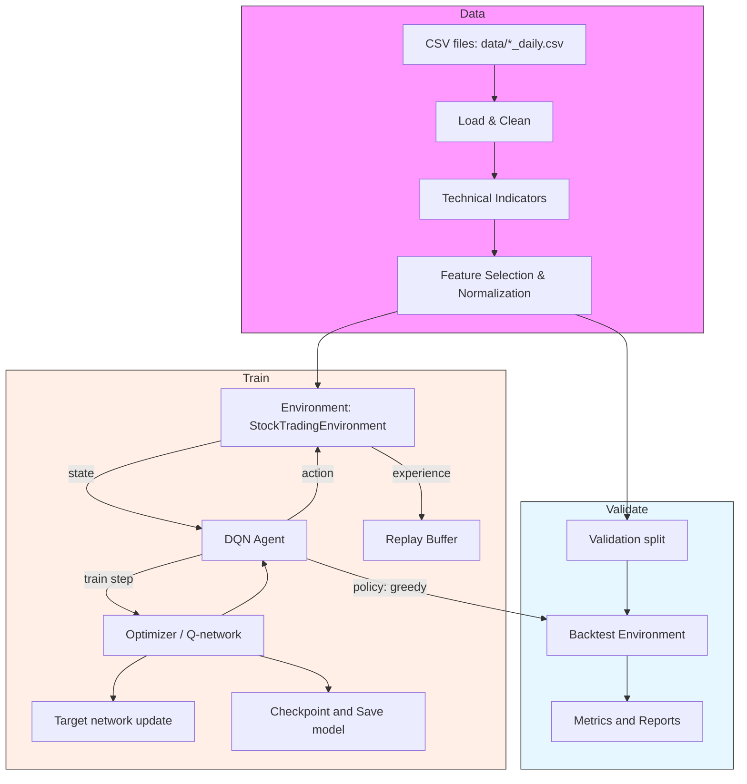

# DQN Architecture — Detailed Technical Overview 📘

**File:** `reports/DQN_Architecture_Detailed.md`
**Generated:** 2026-01-06

---

## Contents
1. Overview
2. High-level component diagram (Mermaid)
3. Data pipeline & feature engineering
4. Environment design (state, action, reward)
5. Agent design and neural network architecture
6. Training algorithm and schedules
7. Experience replay and memory
8. Model persistence, logging, and checkpoints
9. Validation and evaluation
10. Implementation notes & code references
11. Reproducibility and recommended experiments
12. Appendix: hyperparameters and formulas

---

## 1. Overview
This document provides a comprehensive, research-grade description of the DQN-based trading system implemented in the repository. It covers the data pipeline, feature engineering, environment dynamics, reward design, agent neural architecture, training loop and optimizers, and evaluation procedures. All references to code are to the files in `src/` (e.g., `dqn_model.py`, `training.py`, `trading_environment.py`, `technical_indicators.py`, `validation.py`). Use this as a source for methods, equations, and reproduction steps.

---

## 2. High-level component diagram (Mermaid)

> Diagram notes: The mermaid diagram above depicts the processing and control flow: CSV data → features → normalized dataset. During training, the environment and agent interact (state→action→next_state), episodes produce experiences stored in the replay buffer, and the agent performs periodic learning updates using mini-batches sampled from memory. During validation, the model runs deterministically (greedy policy) on held-out data to produce backtest metrics.

---

## 3. Data Pipeline & Feature Engineering 🔬

### 3.1 Raw data and format
- Input: CSV files per symbol in `data/` (e.g., `AMZN_daily.csv`). Expected columns after initial cleaning: `date, close, high, low, open, volume`.
- `ModelTrainer.load_csv_data()` performs robust parsing: it locates the first valid date row, coerces numeric columns, enforces non-negative prices/volume, sorts by date index.

### 3.2 Feature computation (see `TechnicalIndicators`)
- Implemented indicators (non-exhaustive): SMAs (5,10,20,50,100), EMAs, RSI (14,30), MACD (macd, signal, hist), Stochastic K/D, Williams %R, Bollinger Bands (upper/mid/lower), BB width/position/%B, ATR/NATR, OBV, AD, ADOSC, VWAP (cumulative approx), price change features (1d,5d,10d,30d), volatility (rolling std), ADX, CCI, candle patterns (Doji, Hammer), gap indicator, support/resistance distance.
- Implementation details: uses TA-Lib for many indicators; uses rolling windows and cummulative operations for VWAP.

### 3.3 Feature selection and cleaning
- `TechnicalIndicators.get_feature_columns()` enumerates features; `prepare_features_for_model()` filters available ones, replaces infinities with 0, and fills NaNs.
- Final feature matrix: typically 54 market features (varies if some indicators are missing) + 5 portfolio features appended during environment observation → total `state_dim` = 59 in pipeline.

### 3.4 Normalization
- `MinMaxScaler` from scikit-learn is used in `ModelTrainer`.
- Important current behavior: validation sometimes calls `normalize_data(..., fit_scaler=True)` on test data — this causes normalization leakage. It is recommended to persist the scaler fitted on training data and use it for validation/test.

---

## 4. Environment Design (State, Action, Reward) 🏛️

### 4.1 State (Observation) space
- Market features: vector of selected technical indicators and raw OHLCV. For step t, the market vector is the feature row at t.
- Portfolio features appended and normalized: 
  - Normalized balance = balance / initial_balance
  - Normalized shares = shares_held / max_shares
  - Normalized net_worth = net_worth / initial_balance
  - Normalized position_value = shares_held * price / initial_balance
  - Portfolio return = (net_worth - initial_balance) / initial_balance
- Final observation is a 1D numpy float32 array (`shape=(state_dim,)`). `StockTradingEnvironment._get_observation()` ensures finite numbers via `np.nan_to_num()`.

### 4.2 Action space
- Discrete(3): {0: HOLD, 1: BUY, 2: SELL}.
- Implementation specifics:
  - **Buy**: buy as many shares as possible from available balance, adjusted for transaction cost and capped at a position size limit (10% of initial balance per buy by default). The code returns `(shares_to_buy, total_cost)`.
  - **Sell**: sell entire position (liquidate all shares held) and compute reward depending on realized profit vs average buy price.
- Limitations: Only full liquidation sells; no partial sizing actions. This simplifies action set but reduces expressiveness.

### 4.3 Reward function design
Implemented in `StockTradingEnvironment.step()` and helper methods:
- Immediate trade bonuses/penalties:
  - Buy: +0.01 reward (encourages entry)
  - Sell: +0.02 if selling profitably (based on average buy price), -0.01 if selling at a loss
  - Action penalty: −0.01 for any non-hold action (discourage excessive trading)
  - New maximum net-worth bonus: +0.05 the first time a new max is achieved in the episode
- Portfolio change component:
  - reward += portfolio_return * 10 where portfolio_return = (net_worth - previous_net_worth) / previous_net_worth. This amplifies portfolio changes (realized or unrealized) and provides dense feedback.
- Design rationale: combining event-based rewards with continuous portfolio feedback encourages both profitable trades and good risk-adjusted accumulation of wealth. However, mixing realized/unrealized PnL in the reward can bias the agent toward short-term fluctuations; separating realized and unrealized parts for reward/auxiliary feedback is recommended for analysis and stability.

---

## 5. Agent Design & Neural Network Architecture 🧠

### 5.1 Agent API
- Class: `DQNAgent` (`src/dqn_model.py`)
- Key public methods:
  - `act(state, training=True)` → returns action (int). During training it is epsilon-greedy; during evaluation set `training=False` to use greedy policy (argmax of Q-values).
  - `remember(state, action, reward, next_state, done)` → stores experience in replay memory
  - `replay()` → sample mini-batch and perform gradient step
  - `update_target_network()` → copy weights from Q-network to target network
  - `save_model(filepath)` / `load_model(filepath)` → serialize model state + optimizer + epsilon and training_losses

### 5.2 Neural network architecture
- Implementation: `DQNAgent._build_network()` returns an `nn.Sequential` network:
  - Input layer → Linear(state_dim → 1024)
  - LayerNorm(1024) → ReLU → Dropout(0.2)
  - Linear(1024 → 512) → LayerNorm(512) → ReLU → Dropout(0.15)
  - Linear(512 → 256) → LayerNorm(256) → ReLU → Dropout(0.1)
  - Linear(256 → 128) → LayerNorm(128) → ReLU → Dropout(0.05)
  - Linear(128 → 64) → ReLU
  - Output layer: Linear(64 → action_dim=3)
- Regularization & concerns:
  - Layer normalization stabilizes learning across large batch sizes and prevents covariate shift inside mini-batches.
  - Dropout is used between layers to reduce overfitting. Note: dropout during training but not during evaluation.
  - Final Q-values are unbounded real numbers — no activation on output.

### 5.3 Loss and optimizer
- Loss: MSE between current Q(s,a) and target Q-value (TD target). Implementation uses `F.mse_loss(current_q_values, target_q_values)`.
- Target value (Double DQN):
  - next_actions = argmax_a Q_online(next_state, a)
  - next_q_values = Q_target(next_state, next_actions)
  - target = reward + gamma * next_q_values * (1 - done)
- Optimizer: `optim.Adam` with a small weight decay (L2) and gradient clipping (`clip_grad_norm_` with max_norm = 1.0).

### 5.4 Exploration policy
- Epsilon-greedy with decay:
  - Start: ε = 1.0 (in agent constructor)
  - Per-replay step decay: agent multiplies ε by `epsilon_decay` until `epsilon_min` (defaults: decay = 0.995 in agent, trainer sets 0.999 externally; min=0.01)
- Notes: A slower decay (e.g., 0.999) keeps exploration longer; per-step vs per-episode decay choices affect sample efficiency.

### 5.5 Device & compute
- GPU-aware: `DQNAgent` moves network and tensors to CUDA device if available (`use_gpu=True`) and adjusts batch sizes and memory sizes accordingly (e.g., batch_size=512 for GPU, memory_size=40000).

---

## 6. Training Algorithm & Schedules 🔁

### 6.1 Overall training flow (per `ModelTrainer.train_model()`)
- Prepare dataset → normalize (fitted on training set) → build env + agent → run episodes.
- For each episode:
  - Reset environment
  - Loop over steps until `done` (episode lasts full dataset length):
    - action = agent.act(state, training=True)
    - next_state, reward, done, info = env.step(action)
    - agent.remember(...)
    - If memory sufficiently large, call `agent.replay()` multiple times (up to 3 replays per step to accelerate learning)
  - Periodically (every save_freq), save checkpoint; if episode reward > best reward then save best model
  - Every 10 episodes call `agent.update_target_network()`

### 6.2 Key hyperparameters and values present in repo
- Learning rate: 1e-4 (Adam)
- Discount factor γ: 0.99
- Epsilon decay: 0.999 (trainer), epsilon_min: 0.01
- Batch size: 512 if GPU else 128
- Replay memory: 40000 if GPU else 20000
- Replay per step: up to 3 replays per step once memory > batch_size
- Target update frequency: every 10 episodes
- Episode length: one pass through the normalized dataset (episode length = #rows - 1)

### 6.3 Practical considerations
- Replaying multiple batches per step speeds up learning but can cause overfitting to recent experiences; consider tuning replay-per-step count.
- The code uses MSE loss on single-step TD-targets; using Huber loss (smooth L1) is often more robust to outliers and noisy financial rewards.

---

## 7. Experience Replay & Memory 🧾

### 7.1 Buffer
- Memory implemented as a Python list with thread lock for safe concurrent access, fixed capacity (pop oldest when capacity reached).
- Stored tuple: (state, action, reward, next_state, done)

### 7.2 Sampling and GPU preparation
- Batch sampling uses NumPy RNG (`np.random.default_rng(seed=42)`) for reproducibility.
- Batches converted to tensors and moved to device; states stacked into FloatTensor of shape (batch_size, state_dim).

### 7.3 Possible extensions
- **Prioritized Experience Replay (PER)** to bias sampling toward unexpected transitions (higher TD-error). Recommended for non-stationary reward distributions.
- **N-step returns** to improve credit assignment for delayed rewards in trading episodes.
- **On-policy mixing** or importance sampling corrections if integrating prioritized replay.

---

## 8. Model Persistence, Logging, and Checkpoints 💾

- Model save format: `torch.save()` dictionary with:
  - q_network state dict, target network state dict, optimizer state dict, epsilon, training_losses and hyperparameters
- Metadata JSON saved alongside `.pth` with symbol, episode, timestamp, state_dim, action_dim, epsilon and summary stats.
- Training history (episode rewards, profits, trades) saved to `logs/{symbol}_training_history_{timestamp}.json`.
- Validation saves backtest results to `validation_logs/backtest_{symbol}_{timestamp}.json` and can generate a `validation_report_{symbol}_{timestamp}.md`.

---

## 9. Validation & Evaluation Protocol 🧪

### 9.1 Backtest protocol
- Use held-out portion (by default `test_split=0.2`) of prepared dataset for validation.
- Normalize test data with training-fitted scaler (recommended) then run environment deterministically with `agent.act(state, training=False)`.
- Compute metrics: total return, annualized return, Sharpe, max drawdown, volatility, total trades, win rate, action distribution, final balance.

### 9.2 Walk-forward & model comparison
- Walk-forward: sliding windows (`window_size` default 252 days, `step_size` 21) are analyzed to estimate robustness across time.
- Compare `best` vs `final` checkpoints using `compare_models()` method, using total_return as primary ranking.

---

## 10. Implementation Notes & Code References 🔎
- DQN Agent: `src/dqn_model.py` — architecture, replay, act/replay/save/load
- Trainer: `src/training.py` — data loading, training loop, saving models/histories
- Environment: `src/trading_environment.py` — observation, action exec, reward shaping, metrics
- Features: `src/technical_indicators.py` — all indicator calculations & feature list
- Validation: `src/validation.py` — backtest, walk-forward, comparison, report generation
- CLI & orchestration: `src/main.py`

---

## 11. Reproducibility, Experiments & Suggested Ablations ⚖️

### 11.1 Reproducibility checklist
- Fix random seeds consistently: NumPy RNG seed (already used in DQNAgent), PyTorch seed, and any system-level randomness.
- Persist scaler, model metadata (hyperparameters & seed), training history, and artifacts for each run.
- Store training logs and plotting figures for reproducibility and result auditing.

### 11.2 Suggested experiments and ablations for research
- Baseline comparisons: Random policy, Buy-and-hold, Momentum rule-based strategies, Supervised policy (predict next-day direction), DQN
- Ablate reward terms: train with/without action bonuses, with realized PnL only, with portfolio_return scaled differently
- Vary network size and regularization (LayerNorm vs BatchNorm, dropout rates)
- Try variants: Dueling-DQN, Double-DQN (already included), PER, n-step returns, categorical/distributional RL (C51, QR-DQN)
- Compare discrete-action (current) vs continuous/parameterized actions (actor-critic with continuous action representing trade size)
- Use walk-forward cross-validation to test generalization across market regimes

---

## 12. Appendix: hyperparameters, formulas and metrics 📐

### 12.1 Core hyperparameters (from repo)
- lr = 1e-4, gamma = 0.99, epsilon_decay ≈ 0.999, epsilon_min = 0.01
- batch_size = 512 (GPU) / 128 (CPU), memory_size = 40000 (GPU) / 20000 (CPU)
- replay_per_step = up to 3
- target_update_freq = 10 episodes

### 12.2 Key formulas
- TD target (Double DQN):
  - a* = argmax_a Q_online(next_state, a)
  - y = reward + γ * Q_target(next_state, a*) * (1 - done)
  - Loss = MSE(Q_online(state, action), y)

- Sharpe ratio (daily -> annualized approximation):
  - sr = mean(excess_returns) / std(excess_returns) * sqrt(252)
  - excess_returns = daily_returns - (risk_free_rate / 252)

- Max drawdown: iteratively compute peak and drawdown = (peak - value) / peak, take max

---

## Closing notes
This document is intended to be a thorough, citable, technical reference for the DQN trading system in this repository. If you want, I can also:
- Generate variant diagrams (sequence diagrams, detailed architecture UML, PNG exports)
- Create an abridged one-page architecture figure or LaTeX-compatible description for your paper
- Implement a canonical experiment script that trains, evaluates, and outputs a reproducibility artifact (scaler + seed + checkpoints)

If you'd like any section expanded (mathematical derivations, pseudocode, or additional diagrams), tell me which parts to prioritize and I'll produce them next.
