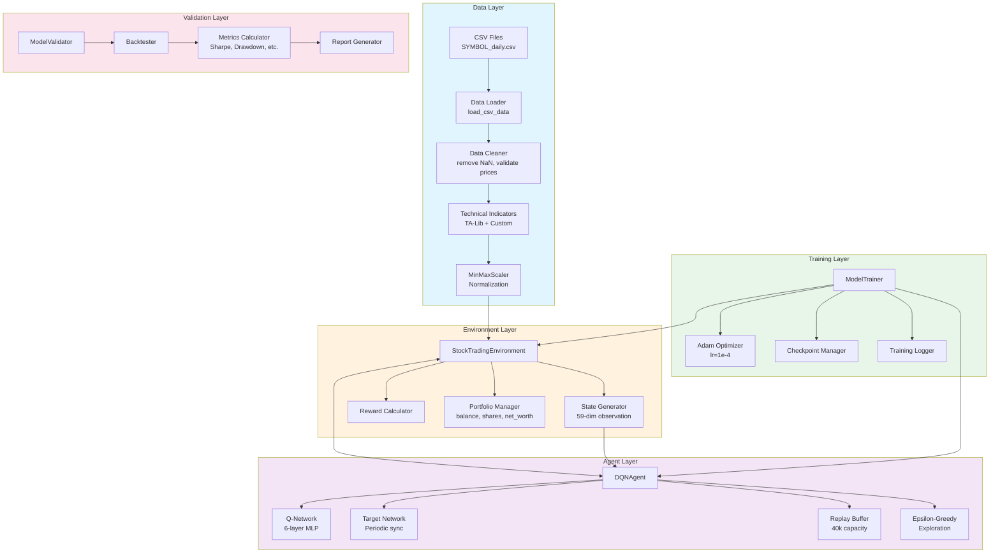
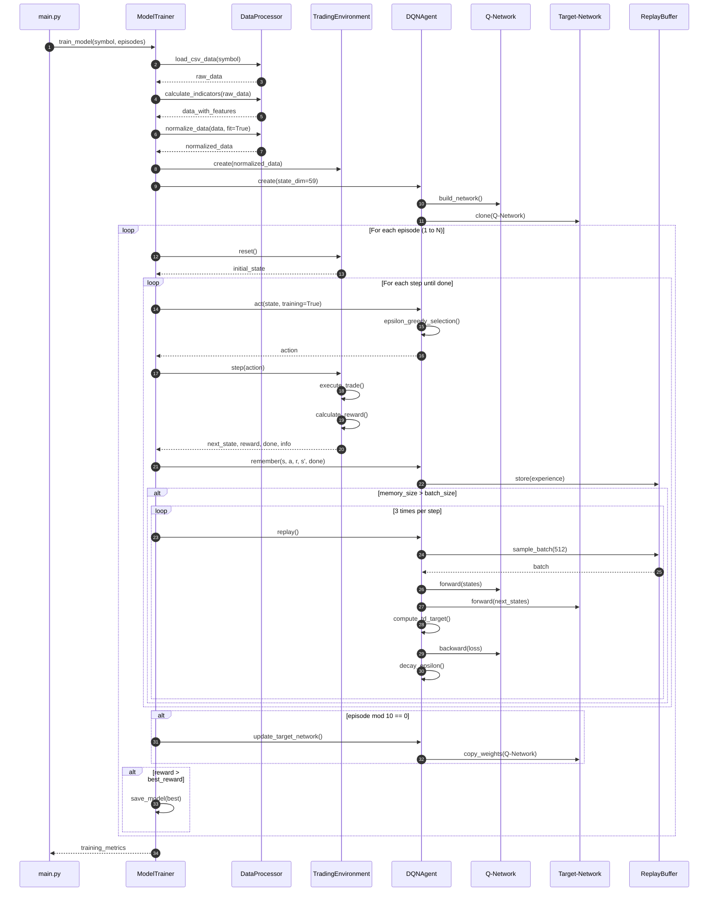
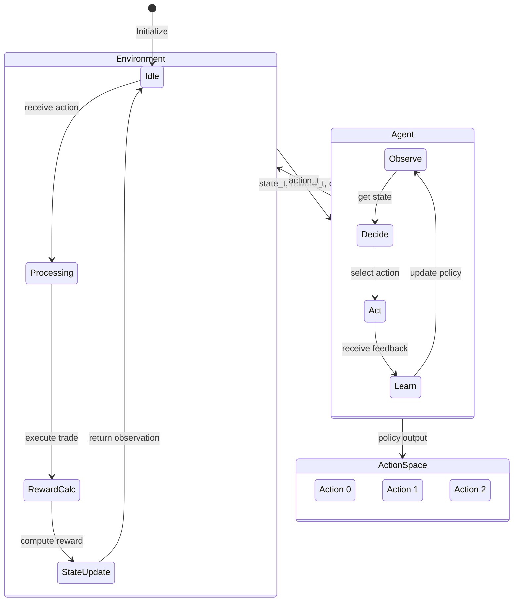
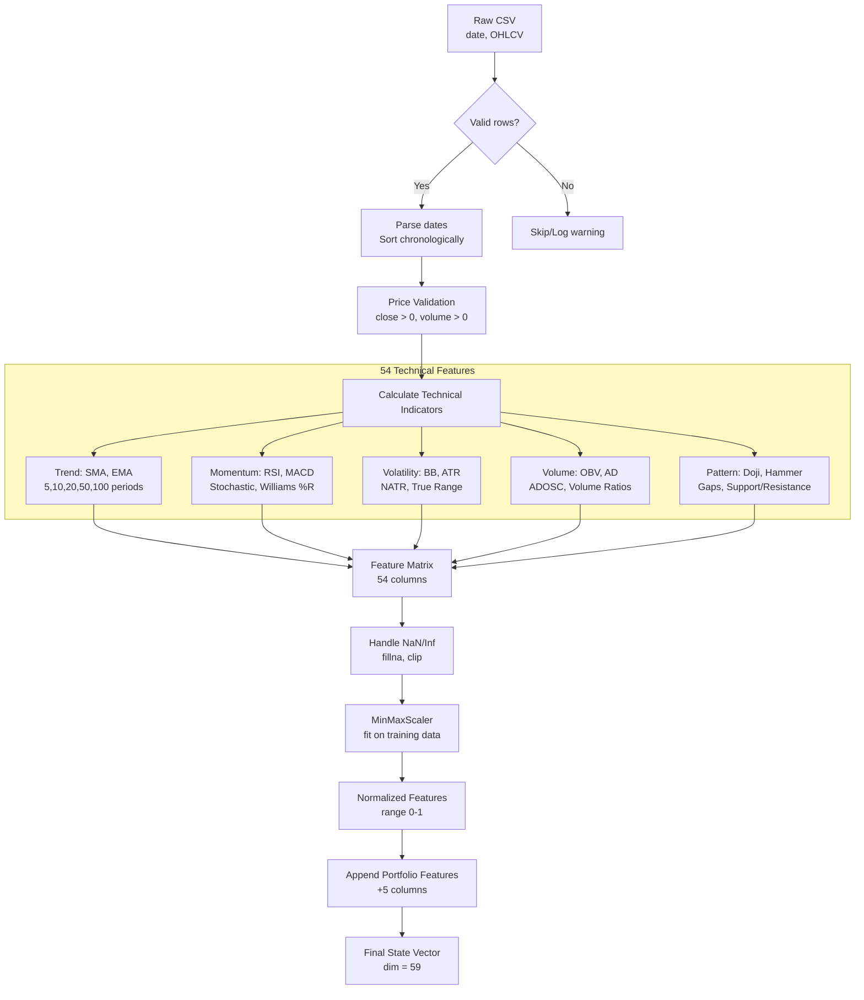
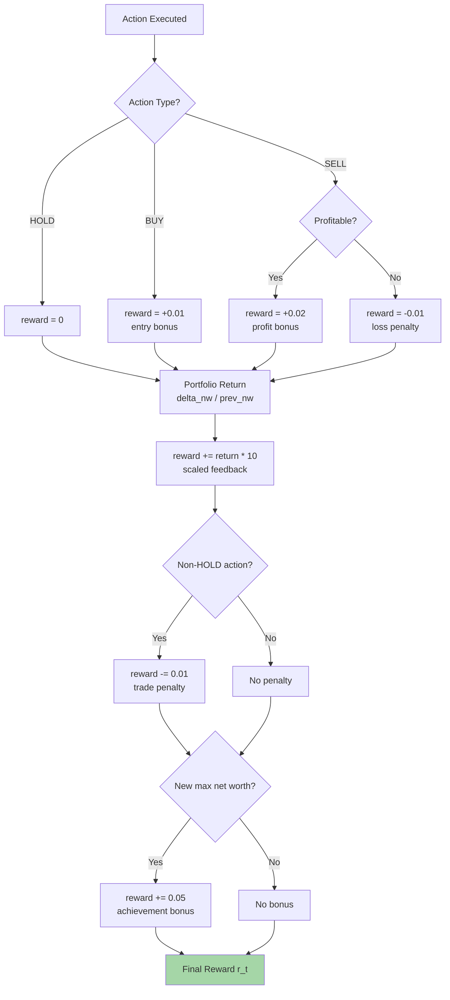
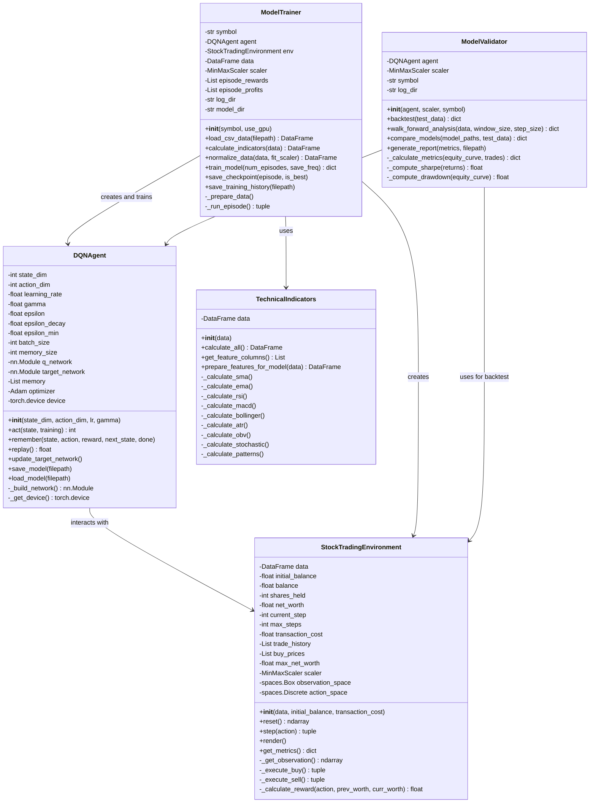
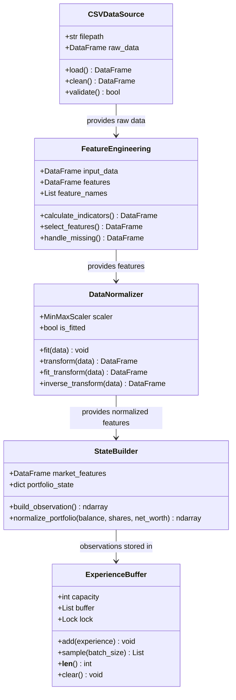
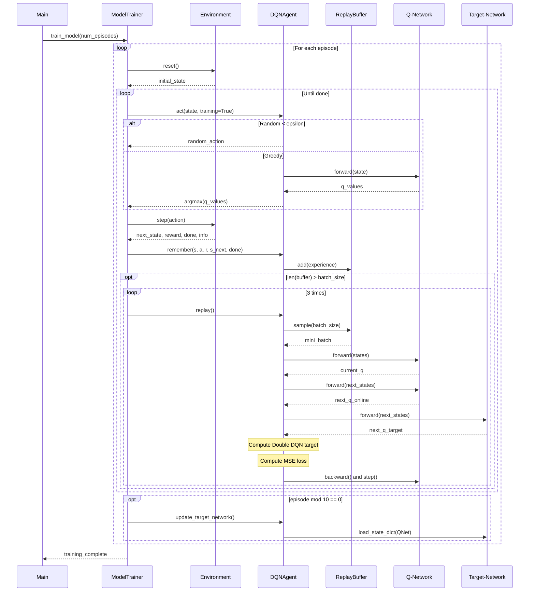

# Deep Q-Network Stock Trading System — Technical Reference

**Document Type:** Citable Technical Reference for Research  
**Repository:** `OpenVanguard/Trade-Agent`  
**Generated:** 2026-01-06  
**Version:** 2.0 (Expanded)

---

## Table of Contents

1. [Introduction and Problem Formulation](#1-introduction-and-problem-formulation)
2. [System Architecture Diagrams](#2-system-architecture-diagrams)
   - 2.1 High-Level Component Diagram
   - 2.2 Training Sequence Diagram
   - 2.3 Agent-Environment Interaction Diagram
   - 2.4 Neural Network Architecture Diagram
   - 2.5 Data Pipeline Flowchart
   - 2.6 Reward Flow Diagram
   - 2.7 UML Class Diagram - Core Components
   - 2.8 UML Class Diagram - Data Flow
   - 2.9 UML Sequence Diagram - Training Episode
3. [Mathematical Formulation](#3-mathematical-formulation)
   - 3.1 MDP Definition
   - 3.2 Q-Learning and Bellman Equation
   - 3.3 Double DQN Target
   - 3.4 Reward Function Formalization
   - 3.5 Performance Metrics
   - 3.6 Gradient Computation Derivations
   - 3.7 Convergence Analysis
4. [Pseudocode](#4-pseudocode)
   - 4.1 Training Algorithm
   - 4.2 Experience Replay
   - 4.3 Action Selection
   - 4.4 Environment Step
   - 4.5 Validation and Backtest Algorithm
   - 4.6 Walk-Forward Validation Algorithm
   - 4.7 Model Comparison Algorithm
5. [LaTeX-Compatible Descriptions](#5-latex-compatible-descriptions)
   - 5.1 Abstract
   - 5.2 Network Architecture
   - 5.3 Reward Function
   - 5.4 Double DQN Update
   - 5.5 Full Methodology Section
6. [One-Page Architecture Summary](#6-one-page-architecture-summary)
7. [Appendix: Hyperparameters Table](#7-appendix-hyperparameters-table)
8. [References and Citation](#8-references-and-citation)
9. [Ablation Study Templates](#9-ablation-study-templates)
   - 9.1 Ablation Study Framework
   - 9.2 Baseline Comparison Framework
   - 9.3 Hyperparameter Sensitivity Analysis

---

## 1. Introduction and Problem Formulation

### 1.1 Problem Statement

This system addresses the **sequential decision-making problem** of stock trading using Deep Reinforcement Learning. Given historical price data and technical indicators, an agent learns a policy to maximize cumulative portfolio returns by choosing discrete trading actions (Hold, Buy, Sell) at each time step.

### 1.2 Formal Problem Definition

The trading problem is formulated as a **Markov Decision Process (MDP)** defined by the tuple:

$$\mathcal{M} = \langle \mathcal{S}, \mathcal{A}, \mathcal{P}, \mathcal{R}, \gamma \rangle$$

Where:
- $\mathcal{S}$: State space (market features + portfolio state)
- $\mathcal{A}$: Action space $\{0: \text{HOLD}, 1: \text{BUY}, 2: \text{SELL}\}$
- $\mathcal{P}$: Transition dynamics (determined by market data)
- $\mathcal{R}$: Reward function
- $\gamma$: Discount factor (0.99)

---

## 2. System Architecture Diagrams

### 2.1 High-Level Component Diagram



### 2.2 Training Sequence Diagram



### 2.3 Agent-Environment Interaction Diagram



### 2.4 Neural Network Architecture Diagram

```mermaid
flowchart LR
    subgraph Input["Input Layer"]
        I["State Vector<br/>dim = 59"]
    end

    subgraph Hidden1["Hidden Block 1"]
        L1["Linear: 59 → 1024"]
        LN1["LayerNorm: 1024"]
        R1["ReLU"]
        D1["Dropout: 0.2"]
    end

    subgraph Hidden2["Hidden Block 2"]
        L2["Linear: 1024 → 512"]
        LN2["LayerNorm: 512"]
        R2["ReLU"]
        D2["Dropout: 0.15"]
    end

    subgraph Hidden3["Hidden Block 3"]
        L3["Linear: 512 → 256"]
        LN3["LayerNorm: 256"]
        R3["ReLU"]
        D3["Dropout: 0.1"]
    end

    subgraph Hidden4["Hidden Block 4"]
        L4["Linear: 256 → 128"]
        LN4["LayerNorm: 128"]
        R4["ReLU"]
        D4["Dropout: 0.05"]
    end

    subgraph Hidden5["Hidden Block 5"]
        L5["Linear: 128 → 64"]
        R5["ReLU"]
    end

    subgraph Output["Output Layer"]
        O["Linear: 64 → 3"]
        Q["Q-Values<br/>Q(s,HOLD), Q(s,BUY), Q(s,SELL)"]
    end

    I --> L1 --> LN1 --> R1 --> D1
    D1 --> L2 --> LN2 --> R2 --> D2
    D2 --> L3 --> LN3 --> R3 --> D3
    D3 --> L4 --> LN4 --> R4 --> D4
    D4 --> L5 --> R5
    R5 --> O --> Q

    style Input fill:#bbdefb
    style Output fill:#c8e6c9
```



### 2.5 Data Pipeline Flowchart



### 2.6 Reward Flow Diagram



### 2.7 UML Class Diagram - Core Components



### 2.8 UML Class Diagram - Data Flow



### 2.9 UML Sequence Diagram - Training Episode



---

## 3. Mathematical Formulation

### 3.1 MDP Definition

**State Space** $\mathcal{S}$:

$$s_t = [x_t^{(1)}, x_t^{(2)}, \ldots, x_t^{(54)}, p_t^{(1)}, p_t^{(2)}, p_t^{(3)}, p_t^{(4)}, p_t^{(5)}] \in \mathbb{R}^{59}$$

Where:
- $x_t^{(i)}$ = normalized market feature $i$ at time $t$ (technical indicators)
- $p_t^{(1)}$ = $\frac{\text{balance}_t}{\text{initial\_balance}}$ (normalized cash)
- $p_t^{(2)}$ = $\frac{\text{shares}_t}{\text{max\_shares}}$ (normalized position)
- $p_t^{(3)}$ = $\frac{\text{net\_worth}_t}{\text{initial\_balance}}$ (normalized portfolio value)
- $p_t^{(4)}$ = $\frac{\text{shares}_t \cdot \text{price}_t}{\text{initial\_balance}}$ (normalized position value)
- $p_t^{(5)}$ = $\frac{\text{net\_worth}_t - \text{initial\_balance}}{\text{initial\_balance}}$ (portfolio return)

**Action Space** $\mathcal{A}$:

$$\mathcal{A} = \{0, 1, 2\} \quad \text{where } a = \begin{cases} 0 & \text{HOLD} \\ 1 & \text{BUY} \\ 2 & \text{SELL} \end{cases}$$

**Transition Dynamics** $\mathcal{P}$:

$$P(s_{t+1} | s_t, a_t) = P_{\text{market}}(x_{t+1} | x_t) \cdot P_{\text{portfolio}}(p_{t+1} | p_t, a_t, x_{t+1})$$

The market dynamics are determined by historical data (non-stationary); portfolio dynamics are deterministic given the action and next price.

### 3.2 Q-Learning and Bellman Equation

**Optimal Action-Value Function**:

$$Q^*(s, a) = \mathbb{E}\left[ r_t + \gamma \max_{a'} Q^*(s_{t+1}, a') \mid s_t = s, a_t = a \right]$$

**Bellman Optimality Equation**:

$$Q^*(s, a) = \mathbb{E}_{s'}\left[ r + \gamma \max_{a'} Q^*(s', a') \right]$$

**DQN Approximation** with neural network $Q(s, a; \theta)$:

$$\theta_{t+1} = \theta_t + \alpha \left( y_t - Q(s_t, a_t; \theta_t) \right) \nabla_\theta Q(s_t, a_t; \theta_t)$$

Where $y_t$ is the TD target (see below).

### 3.3 Double DQN Target

Standard DQN suffers from overestimation bias. **Double DQN** decouples action selection from value estimation:

**Double DQN Target**:

$$y_t^{\text{DDQN}} = r_t + \gamma \cdot Q(s_{t+1}, \arg\max_{a'} Q(s_{t+1}, a'; \theta); \theta^-)$$

Expanded form:

$$a^* = \arg\max_{a'} Q_{\text{online}}(s_{t+1}, a'; \theta)$$

$$y_t = r_t + \gamma \cdot Q_{\text{target}}(s_{t+1}, a^*; \theta^-) \cdot (1 - \mathbb{1}_{\text{done}})$$

Where:
- $\theta$ = online network parameters (updated every step)
- $\theta^-$ = target network parameters (updated every 10 episodes)
- $\mathbb{1}_{\text{done}}$ = terminal state indicator

**Loss Function** (Mean Squared Error):

$$\mathcal{L}(\theta) = \mathbb{E}_{(s,a,r,s') \sim \mathcal{D}} \left[ \left( y_t - Q(s, a; \theta) \right)^2 \right]$$

Where $\mathcal{D}$ is the replay buffer.

### 3.4 Reward Function Formalization

The reward function $r_t = R(s_t, a_t, s_{t+1})$ is defined as:

$$r_t = r_{\text{action}} + r_{\text{portfolio}} + r_{\text{penalty}} + r_{\text{bonus}}$$

**Component Definitions**:

$$r_{\text{action}} = \begin{cases}
+0.01 & \text{if } a_t = \text{BUY and executed} \\
+0.02 & \text{if } a_t = \text{SELL and } \bar{p}_{\text{buy}} < p_t \\
-0.01 & \text{if } a_t = \text{SELL and } \bar{p}_{\text{buy}} \geq p_t \\
0 & \text{otherwise}
\end{cases}$$

$$r_{\text{portfolio}} = 10 \cdot \frac{W_t - W_{t-1}}{W_{t-1}}$$

Where $W_t$ = net worth at time $t$, and $\bar{p}_{\text{buy}}$ = average buy price.

$$r_{\text{penalty}} = \begin{cases}
-0.01 & \text{if } a_t \neq \text{HOLD} \\
0 & \text{otherwise}
\end{cases}$$

$$r_{\text{bonus}} = \begin{cases}
+0.05 & \text{if } W_t > \max_{i < t} W_i \\
0 & \text{otherwise}
\end{cases}$$

### 3.5 Performance Metrics

**Total Return**:

$$R_{\text{total}} = \frac{W_T - W_0}{W_0}$$

**Annualized Return**:

$$R_{\text{annual}} = (1 + R_{\text{total}})^{252/T} - 1$$

**Sharpe Ratio** (daily returns, annualized):

$$\text{SR} = \frac{\mathbb{E}[r_{\text{daily}}] - r_f}{\sigma(r_{\text{daily}})} \cdot \sqrt{252}$$

Where $r_f$ = risk-free rate (default 0.02 annual), $r_{\text{daily}} = \frac{W_t - W_{t-1}}{W_{t-1}}$

**Maximum Drawdown**:

$$\text{MDD} = \max_{t \in [0,T]} \left( \frac{\max_{i \in [0,t]} W_i - W_t}{\max_{i \in [0,t]} W_i} \right)$$

**Win Rate**:

$$\text{WR} = \frac{\text{Number of profitable trades}}{\text{Total number of trades}}$$

### 3.6 Gradient Computation Derivations

**Gradient of the Loss Function**:

The loss function for DQN is:

$$\mathcal{L}(\theta) = \frac{1}{|\mathcal{B}|} \sum_{(s,a,r,s') \in \mathcal{B}} \left( y - Q(s, a; \theta) \right)^2$$

Where $\mathcal{B}$ is a mini-batch sampled from replay buffer $\mathcal{D}$.

**Chain Rule Application**:

$$\nabla_\theta \mathcal{L}(\theta) = \frac{1}{|\mathcal{B}|} \sum_{(s,a,r,s') \in \mathcal{B}} \nabla_\theta \left( y - Q(s, a; \theta) \right)^2$$

$$= \frac{1}{|\mathcal{B}|} \sum_{(s,a,r,s') \in \mathcal{B}} 2 \left( y - Q(s, a; \theta) \right) \cdot \left( -\nabla_\theta Q(s, a; \theta) \right)$$

$$= -\frac{2}{|\mathcal{B}|} \sum_{(s,a,r,s') \in \mathcal{B}} \delta_t \cdot \nabla_\theta Q(s, a; \theta)$$

Where $\delta_t = y - Q(s, a; \theta)$ is the **Temporal Difference (TD) error**.

**Parameter Update Rule (Stochastic Gradient Descent)**:

$$\theta_{t+1} = \theta_t - \alpha \nabla_\theta \mathcal{L}(\theta_t)$$

$$= \theta_t + \frac{2\alpha}{|\mathcal{B}|} \sum_{(s,a,r,s') \in \mathcal{B}} \delta_t \cdot \nabla_\theta Q(s, a; \theta_t)$$

**For Single Sample (Online Learning)**:

$$\theta_{t+1} = \theta_t + \alpha \cdot \delta_t \cdot \nabla_\theta Q(s_t, a_t; \theta_t)$$

**Neural Network Gradient (Backpropagation)**:

For a multi-layer network $Q(s, a; \theta) = f^{(L)}(f^{(L-1)}(\cdots f^{(1)}(s)))$ with layer weights $\{W^{(l)}, b^{(l)}\}$:

$$\frac{\partial \mathcal{L}}{\partial W^{(l)}} = \frac{\partial \mathcal{L}}{\partial z^{(l)}} \cdot \frac{\partial z^{(l)}}{\partial W^{(l)}} = \delta^{(l)} \cdot (h^{(l-1)})^T$$

Where:
- $z^{(l)} = W^{(l)} h^{(l-1)} + b^{(l)}$ (pre-activation)
- $h^{(l)} = \sigma(z^{(l)})$ (post-activation with ReLU $\sigma$)
- $\delta^{(l)} = \frac{\partial \mathcal{L}}{\partial z^{(l)}}$ (error signal backpropagated)

**Backpropagation Recursion**:

$$\delta^{(l)} = \left( (W^{(l+1)})^T \delta^{(l+1)} \right) \odot \sigma'(z^{(l)})$$

For ReLU: $\sigma'(z) = \mathbb{1}_{z > 0}$ (subgradient at $z=0$)

**Adam Optimizer Update**:

The system uses Adam with the following update equations:

$$m_t = \beta_1 m_{t-1} + (1 - \beta_1) g_t$$
$$v_t = \beta_2 v_{t-1} + (1 - \beta_2) g_t^2$$

$$\hat{m}_t = \frac{m_t}{1 - \beta_1^t}, \quad \hat{v}_t = \frac{v_t}{1 - \beta_2^t}$$

$$\theta_{t+1} = \theta_t - \frac{\alpha}{\sqrt{\hat{v}_t} + \epsilon} \hat{m}_t$$

Where $g_t = \nabla_\theta \mathcal{L}(\theta_t)$, $\beta_1 = 0.9$, $\beta_2 = 0.999$, $\epsilon = 10^{-8}$.

**Gradient Clipping**:

To prevent exploding gradients, we apply:

$$\tilde{g}_t = \begin{cases}
g_t & \text{if } \|g_t\|_2 \leq c \\
\frac{c}{\|g_t\|_2} g_t & \text{otherwise}
\end{cases}$$

Where $c = 1.0$ (max gradient norm).

### 3.7 Convergence Analysis

**Assumptions for Convergence**:

1. **Bounded Rewards**: $|r_t| \leq R_{\max}$ for all $t$
2. **Finite State-Action Space**: Effective due to function approximation
3. **Sufficient Exploration**: $\sum_{t=0}^{\infty} \epsilon_t = \infty$ and $\sum_{t=0}^{\infty} \epsilon_t^2 < \infty$
4. **Lipschitz Continuous Q-function**: $|Q(s, a; \theta) - Q(s, a; \theta')| \leq L_Q \|\theta - \theta'\|$

**Bellman Operator Contraction**:

The Bellman optimality operator $\mathcal{T}$ is a $\gamma$-contraction in the sup-norm:

$$\|\mathcal{T}Q_1 - \mathcal{T}Q_2\|_\infty \leq \gamma \|Q_1 - Q_2\|_\infty$$

**Fixed Point Existence**:

By Banach fixed-point theorem, there exists a unique $Q^*$ such that:

$$\mathcal{T}Q^* = Q^*$$

**DQN Convergence Challenges**:

Unlike tabular Q-learning, DQN with function approximation does not have guaranteed convergence due to:

1. **Deadly Triad**: Combination of function approximation, bootstrapping, and off-policy learning
2. **Non-stationary Targets**: Target $y_t$ depends on changing parameters
3. **Correlated Samples**: Sequential experience is not i.i.d.

**Mitigation Strategies Employed**:

| Challenge | Mitigation | Implementation |
|-----------|------------|----------------|
| Correlated samples | Experience Replay | Buffer size = 40,000, uniform sampling |
| Non-stationary targets | Target Network | Updated every 10 episodes |
| Overestimation bias | Double DQN | Action selection/evaluation decoupled |
| Gradient instability | Gradient Clipping | Max norm = 1.0 |
| Covariate shift | Layer Normalization | Applied after each hidden layer |

**Empirical Convergence Indicators**:

1. **TD Error Decay**: $\mathbb{E}[|\delta_t|] \to 0$ as training progresses
2. **Policy Stability**: Action distribution variance decreases
3. **Reward Convergence**: Episode rewards plateau at stable level
4. **Q-Value Stability**: $\text{Var}[Q(s, a; \theta)]$ decreases over time

**Expected Convergence Rate** (under idealized conditions):

For SGD with learning rate $\alpha_t = \frac{\alpha_0}{t}$:

$$\mathbb{E}[\|Q_t - Q^*\|^2] = O\left(\frac{1}{t}\right)$$

For Adam optimizer (adaptive rates):

$$\mathbb{E}[\mathcal{L}(\theta_t)] - \mathcal{L}^* = O\left(\frac{1}{\sqrt{t}}\right)$$

**Practical Convergence Monitoring**:

$$\text{Smoothed Loss}_t = \beta \cdot \text{Smoothed Loss}_{t-1} + (1-\beta) \cdot \mathcal{L}_t$$

With exponential smoothing factor $\beta = 0.99$.

**Stopping Criteria**:

1. Maximum episodes reached: $t \geq T_{\max}$
2. Loss plateau: $|\mathcal{L}_t - \mathcal{L}_{t-100}| < \epsilon_{\text{loss}}$ for 100 consecutive updates
3. Epsilon minimum reached: $\epsilon_t \leq \epsilon_{\min}$
4. Early stopping: Validation performance degrades for $k$ consecutive checkpoints

---

## 4. Pseudocode

### 4.1 Training Algorithm (Main Loop)

```
Algorithm: DQN_Training
━━━━━━━━━━━━━━━━━━━━━━━━━━━━━━━━━━━━━━━━━━━━━━━━━━━━━━━━━━━━━━━━━━━━━━━━━━━━━━━━

Input:
    symbol          : Stock symbol (e.g., "AMZN")
    num_episodes    : Number of training episodes (default: 1000)
    batch_size      : Mini-batch size for replay (default: 512)
    gamma           : Discount factor (default: 0.99)
    lr              : Learning rate (default: 1e-4)
    epsilon_start   : Initial exploration rate (default: 1.0)
    epsilon_decay   : Exploration decay rate (default: 0.999)
    epsilon_min     : Minimum exploration rate (default: 0.01)
    target_update   : Target network update frequency (default: 10 episodes)
    replay_per_step : Number of replay iterations per step (default: 3)

Output:
    trained_agent   : DQN agent with learned policy
    metrics         : Training performance metrics

━━━━━━━━━━━━━━━━━━━━━━━━━━━━━━━━━━━━━━━━━━━━━━━━━━━━━━━━━━━━━━━━━━━━━━━━━━━━━━━━

1.  data ← LoadAndCleanCSV(symbol)
2.  data ← CalculateTechnicalIndicators(data)
3.  data ← NormalizeData(data, fit_scaler=True)

4.  env ← StockTradingEnvironment(data, initial_balance=10000)
5.  state_dim ← env.observation_space.shape[0]  // 59
6.  action_dim ← 3  // HOLD, BUY, SELL

7.  agent ← DQNAgent(state_dim, action_dim, lr, gamma, epsilon_start)
8.  agent.epsilon ← epsilon_start
9.  best_reward ← -∞

10. FOR episode = 1 TO num_episodes DO:

11.     state ← env.reset()
12.     episode_reward ← 0
13.     done ← False

14.     WHILE NOT done DO:
15.         // Action selection (epsilon-greedy)
16.         action ← agent.act(state, training=True)
17.
18.         // Environment step
19.         next_state, reward, done, info ← env.step(action)
20.
21.         // Store experience
22.         agent.remember(state, action, reward, next_state, done)
23.
24.         // Experience replay (if sufficient memory)
25.         IF len(agent.memory) > batch_size THEN:
26.             FOR i = 1 TO replay_per_step DO:
27.                 loss ← agent.replay()
28.             END FOR
29.         END IF
30.
31.         state ← next_state
32.         episode_reward ← episode_reward + reward
33.
34.     END WHILE
35.
36.     // Target network update
37.     IF episode MOD target_update = 0 THEN:
38.         agent.update_target_network()
39.     END IF
40.
41.     // Save best model
42.     IF episode_reward > best_reward THEN:
43.         best_reward ← episode_reward
44.         SaveModel(agent, symbol, episode, "best")
45.     END IF
46.
47.     // Periodic checkpoint
48.     IF episode MOD 100 = 0 THEN:
49.         SaveModel(agent, symbol, episode, "checkpoint")
50.         LogProgress(episode, episode_reward, agent.epsilon)
51.     END IF
52.
53. END FOR

54. RETURN agent, ComputeMetrics(rewards, profits, trades)
```

### 4.2 Experience Replay Algorithm

```
Algorithm: Experience_Replay
━━━━━━━━━━━━━━━━━━━━━━━━━━━━━━━━━━━━━━━━━━━━━━━━━━━━━━━━━━━━━━━━━━━━━━━━━━━━━━━━

Input:
    memory          : Replay buffer containing experiences
    batch_size      : Number of samples per batch
    gamma           : Discount factor
    Q_online        : Online Q-network (parameters θ)
    Q_target        : Target Q-network (parameters θ⁻)
    optimizer       : Adam optimizer

Output:
    loss            : Training loss value

━━━━━━━━━━━━━━━━━━━━━━━━━━━━━━━━━━━━━━━━━━━━━━━━━━━━━━━━━━━━━━━━━━━━━━━━━━━━━━━━

1.  IF len(memory) < batch_size THEN:
2.      RETURN 0.0
3.  END IF

4.  // Sample random mini-batch
5.  batch ← RandomSample(memory, batch_size)
6.  states, actions, rewards, next_states, dones ← UnpackBatch(batch)

7.  // Convert to tensors and move to GPU
8.  states ← ToTensor(states).to(device)
9.  actions ← ToTensor(actions).to(device)
10. rewards ← ToTensor(rewards).to(device)
11. next_states ← ToTensor(next_states).to(device)
12. dones ← ToTensor(dones).to(device)

13. // Current Q-values: Q(s, a)
14. current_q ← Q_online(states).gather(dim=1, index=actions)

15. // Double DQN target computation
16. WITH no_gradient():
17.     // Select best action using online network
18.     next_actions ← argmax(Q_online(next_states), dim=1)
19.     
20.     // Evaluate using target network
21.     next_q ← Q_target(next_states).gather(dim=1, index=next_actions)
22.     
23.     // TD target: y = r + γ * Q_target(s', a*) * (1 - done)
24.     target_q ← rewards + gamma * next_q * (1 - dones)
25. END WITH

26. // Compute MSE loss
27. loss ← MSE(current_q, target_q)

28. // Gradient descent step
29. optimizer.zero_grad()
30. loss.backward()
31. ClipGradientNorm(Q_online.parameters(), max_norm=1.0)
32. optimizer.step()

33. // Decay epsilon
34. IF agent.epsilon > epsilon_min THEN:
35.     agent.epsilon ← agent.epsilon * epsilon_decay
36. END IF

37. RETURN loss.item()
```

### 4.3 Action Selection (Epsilon-Greedy)

```
Algorithm: Epsilon_Greedy_Action
━━━━━━━━━━━━━━━━━━━━━━━━━━━━━━━━━━━━━━━━━━━━━━━━━━━━━━━━━━━━━━━━━━━━━━━━━━━━━━━━

Input:
    state           : Current observation vector (dim=59)
    epsilon         : Current exploration rate
    training        : Boolean flag for training mode
    Q_network       : Online Q-network

Output:
    action          : Selected action ∈ {0, 1, 2}

━━━━━━━━━━━━━━━━━━━━━━━━━━━━━━━━━━━━━━━━━━━━━━━━━━━━━━━━━━━━━━━━━━━━━━━━━━━━━━━━

1.  IF training AND Random() < epsilon THEN:
2.      // Exploration: random action
3.      action ← RandomChoice({0, 1, 2})
4.  ELSE:
5.      // Exploitation: greedy action
6.      state_tensor ← ToTensor(state).unsqueeze(0).to(device)
7.      WITH no_gradient():
8.          q_values ← Q_network(state_tensor)
9.      END WITH
10.     action ← argmax(q_values).item()
11. END IF

12. RETURN action
```

### 4.4 Environment Step

```
Algorithm: Environment_Step
━━━━━━━━━━━━━━━━━━━━━━━━━━━━━━━━━━━━━━━━━━━━━━━━━━━━━━━━━━━━━━━━━━━━━━━━━━━━━━━━

Input:
    action          : Trading action ∈ {0: HOLD, 1: BUY, 2: SELL}
    current_step    : Current time index in data
    balance         : Current cash balance
    shares_held     : Current shares owned
    data            : Normalized market data

Output:
    next_state      : New observation vector
    reward          : Scalar reward
    done            : Episode termination flag
    info            : Dictionary with metadata

━━━━━━━━━━━━━━━━━━━━━━━━━━━━━━━━━━━━━━━━━━━━━━━━━━━━━━━━━━━━━━━━━━━━━━━━━━━━━━━━

1.  price ← GetCurrentPrice(data, current_step)
2.  previous_net_worth ← balance + shares_held * price
3.  reward ← 0.0

4.  // Execute action
5.  IF action = BUY THEN:
6.      available ← balance * (1 - transaction_cost)
7.      max_shares ← floor(available / price)
8.      position_limit ← floor(initial_balance * 0.1 / price)
9.      shares_to_buy ← min(max_shares, position_limit)
10.     
11.     IF shares_to_buy > 0 THEN:
12.         cost ← shares_to_buy * price * (1 + transaction_cost)
13.         balance ← balance - cost
14.         shares_held ← shares_held + shares_to_buy
15.         reward ← reward + 0.01  // Buy bonus
16.         RecordTrade("BUY", shares_to_buy, price)
17.     END IF
18.
19. ELSE IF action = SELL THEN:
20.     IF shares_held > 0 THEN:
21.         revenue ← shares_held * price * (1 - transaction_cost)
22.         avg_buy_price ← ComputeAverageBuyPrice()
23.         
24.         IF price > avg_buy_price THEN:
25.             reward ← reward + 0.02  // Profit bonus
26.         ELSE:
27.             reward ← reward - 0.01  // Loss penalty
28.         END IF
29.         
30.         balance ← balance + revenue
31.         RecordTrade("SELL", shares_held, price)
32.         shares_held ← 0
33.     END IF
34. END IF

35. // Update portfolio value
36. net_worth ← balance + shares_held * price

37. // Portfolio return component
38. portfolio_return ← (net_worth - previous_net_worth) / previous_net_worth
39. reward ← reward + portfolio_return * 10

40. // Trading penalty
41. IF action ≠ HOLD THEN:
42.     reward ← reward - 0.01
43. END IF

44. // New high bonus
45. IF net_worth > max_net_worth THEN:
46.     max_net_worth ← net_worth
47.     reward ← reward + 0.05
48. END IF

49. // Advance step
50. current_step ← current_step + 1
51. done ← (current_step >= max_steps)

52. // Generate observation
53. next_state ← GetObservation(data, current_step, balance, shares_held, net_worth)

54. info ← {net_worth, balance, shares_held, total_trades, portfolio_return}

55. RETURN next_state, reward, done, info
```

### 4.5 Validation and Backtest Algorithm

```
Algorithm: Model_Validation_Backtest
━━━━━━━━━━━━━━━━━━━━━━━━━━━━━━━━━━━━━━━━━━━━━━━━━━━━━━━━━━━━━━━━━━━━━━━━━━━━━━━━

Input:
    agent           : Trained DQN agent
    test_data       : Normalized test dataset (held-out portion)
    scaler          : Fitted MinMaxScaler from training
    initial_balance : Starting portfolio value (default: $10,000)
    transaction_cost: Per-trade fee (default: 0.001)

Output:
    metrics         : Dictionary of performance metrics
    trade_history   : List of all executed trades
    equity_curve    : Time series of portfolio values

━━━━━━━━━━━━━━━━━━━━━━━━━━━━━━━━━━━━━━━━━━━━━━━━━━━━━━━━━━━━━━━━━━━━━━━━━━━━━━━━

1.  // Initialize backtest environment
2.  env ← StockTradingEnvironment(test_data, initial_balance, transaction_cost)
3.  state ← env.reset()
4.
5.  // Initialize tracking variables
6.  done ← False
7.  equity_curve ← [initial_balance]
8.  trade_history ← []
9.  daily_returns ← []
10. actions_taken ← {HOLD: 0, BUY: 0, SELL: 0}
11. peak_value ← initial_balance
12. max_drawdown ← 0
13.
14. // Run backtest loop
15. WHILE NOT done DO:
16.     // Greedy action selection (no exploration)
17.     action ← agent.act(state, training=False)
18.     
19.     // Execute action in environment
20.     next_state, reward, done, info ← env.step(action)
21.     
22.     // Track metrics
23.     net_worth ← info.net_worth
24.     equity_curve.append(net_worth)
25.     actions_taken[action] ← actions_taken[action] + 1
26.     
27.     // Calculate daily return
28.     daily_return ← (net_worth - equity_curve[-2]) / equity_curve[-2]
29.     daily_returns.append(daily_return)
30.     
31.     // Update drawdown tracking
32.     IF net_worth > peak_value THEN:
33.         peak_value ← net_worth
34.     END IF
35.     current_drawdown ← (peak_value - net_worth) / peak_value
36.     max_drawdown ← max(max_drawdown, current_drawdown)
37.     
38.     // Record trade if executed
39.     IF action ≠ HOLD AND info.trade_executed THEN:
40.         trade_history.append({
41.             step: current_step,
42.             action: action,
43.             price: info.price,
44.             shares: info.shares,
45.             value: info.trade_value,
46.             profit: info.profit_loss
47.         })
48.     END IF
49.     
50.     state ← next_state
51. END WHILE
52.
53. // Compute final metrics
54. final_value ← equity_curve[-1]
55. total_return ← (final_value - initial_balance) / initial_balance
56. num_days ← len(equity_curve) - 1
57. annualized_return ← (1 + total_return)^(252 / num_days) - 1
58.
59. // Sharpe Ratio calculation
60. mean_return ← mean(daily_returns)
61. std_return ← std(daily_returns)
62. risk_free_daily ← 0.02 / 252  // 2% annual risk-free rate
63. sharpe_ratio ← (mean_return - risk_free_daily) / std_return * sqrt(252)
64.
65. // Trade analysis
66. profitable_trades ← count(t for t in trade_history if t.profit > 0)
67. total_trades ← len(trade_history)
68. win_rate ← profitable_trades / total_trades if total_trades > 0 else 0
69.
70. // Assemble metrics dictionary
71. metrics ← {
72.     total_return: total_return,
73.     annualized_return: annualized_return,
74.     sharpe_ratio: sharpe_ratio,
75.     max_drawdown: max_drawdown,
76.     volatility: std_return * sqrt(252),
77.     total_trades: total_trades,
78.     win_rate: win_rate,
79.     final_balance: final_value,
80.     action_distribution: actions_taken
81. }
82.
83. RETURN metrics, trade_history, equity_curve
```

### 4.6 Walk-Forward Validation Algorithm

```
Algorithm: Walk_Forward_Validation
━━━━━━━━━━━━━━━━━━━━━━━━━━━━━━━━━━━━━━━━━━━━━━━━━━━━━━━━━━━━━━━━━━━━━━━━━━━━━━━━

Input:
    agent           : Trained DQN agent
    full_data       : Complete normalized dataset
    window_size     : Training window size (default: 252 days = 1 year)
    step_size       : Step forward size (default: 21 days = 1 month)
    scaler          : Fitted scaler from original training

Output:
    window_metrics  : List of metrics for each validation window
    aggregate_stats : Overall performance statistics

━━━━━━━━━━━━━━━━━━━━━━━━━━━━━━━━━━━━━━━━━━━━━━━━━━━━━━━━━━━━━━━━━━━━━━━━━━━━━━━━

1.  window_metrics ← []
2.  total_length ← len(full_data)
3.  start_idx ← 0
4.
5.  // Iterate through windows
6.  WHILE start_idx + window_size < total_length DO:
7.      end_idx ← start_idx + window_size
8.      
9.      // Extract window data
10.     window_data ← full_data[start_idx : end_idx]
11.     
12.     // Run backtest on this window
13.     metrics, trades, equity ← Model_Validation_Backtest(
14.         agent, window_data, scaler
15.     )
16.     
17.     // Store results with window info
18.     window_result ← {
19.         window_start: start_idx,
20.         window_end: end_idx,
21.         start_date: full_data.index[start_idx],
22.         end_date: full_data.index[end_idx - 1],
23.         metrics: metrics
24.     }
25.     window_metrics.append(window_result)
26.     
27.     // Advance window
28.     start_idx ← start_idx + step_size
29. END WHILE
30.
31. // Compute aggregate statistics
32. all_returns ← [w.metrics.total_return for w in window_metrics]
33. all_sharpes ← [w.metrics.sharpe_ratio for w in window_metrics]
34. all_drawdowns ← [w.metrics.max_drawdown for w in window_metrics]
35.
36. aggregate_stats ← {
37.     num_windows: len(window_metrics),
38.     mean_return: mean(all_returns),
39.     std_return: std(all_returns),
40.     mean_sharpe: mean(all_sharpes),
41.     std_sharpe: std(all_sharpes),
42.     worst_drawdown: max(all_drawdowns),
43.     positive_windows: count(r > 0 for r in all_returns),
44.     consistency_ratio: count(r > 0 for r in all_returns) / len(all_returns)
45. }
46.
47. RETURN window_metrics, aggregate_stats
```

### 4.7 Model Comparison Algorithm

```
Algorithm: Compare_Models
━━━━━━━━━━━━━━━━━━━━━━━━━━━━━━━━━━━━━━━━━━━━━━━━━━━━━━━━━━━━━━━━━━━━━━━━━━━━━━━━

Input:
    model_paths     : List of model checkpoint paths to compare
    test_data       : Normalized test dataset
    scaler          : Fitted scaler
    ranking_metric  : Metric to rank by (default: "total_return")

Output:
    comparison      : Ranked list of model performances
    best_model      : Path to best performing model

━━━━━━━━━━━━━━━━━━━━━━━━━━━━━━━━━━━━━━━━━━━━━━━━━━━━━━━━━━━━━━━━━━━━━━━━━━━━━━━━

1.  comparison ← []
2.
3.  FOR each model_path in model_paths DO:
4.      // Load model
5.      agent ← DQNAgent(state_dim=59, action_dim=3)
6.      agent.load_model(model_path)
7.      
8.      // Run validation
9.      metrics, trades, equity ← Model_Validation_Backtest(
10.         agent, test_data, scaler
11.     )
12.     
13.     // Store result
14.     result ← {
15.         model_path: model_path,
16.         model_name: ExtractModelName(model_path),
17.         metrics: metrics,
18.         ranking_value: metrics[ranking_metric]
19.     }
20.     comparison.append(result)
21. END FOR
22.
23. // Sort by ranking metric (descending for returns, ascending for drawdown)
24. IF ranking_metric in ["max_drawdown", "volatility"] THEN:
25.     comparison ← Sort(comparison, by=ranking_value, ascending=True)
26. ELSE:
27.     comparison ← Sort(comparison, by=ranking_value, ascending=False)
28. END IF
29.
30. best_model ← comparison[0].model_path
31.
32. RETURN comparison, best_model
```

---

## 5. LaTeX-Compatible Descriptions

### 5.1 Abstract (for paper)

```latex
\begin{abstract}
We present a Deep Q-Network (DQN) based reinforcement learning system for 
automated stock trading. The system processes daily OHLCV data through a 
comprehensive technical analysis pipeline generating 54 market features, 
which are combined with 5 portfolio state features to form a 59-dimensional 
observation space. A 6-layer multilayer perceptron with Layer Normalization 
and Dropout regularization approximates the action-value function over a 
discrete action space $\mathcal{A} = \{\text{HOLD}, \text{BUY}, \text{SELL}\}$. 
The agent is trained using Double DQN with experience replay and a composite 
reward function incorporating portfolio returns, trade bonuses, and risk 
penalties. Experimental results on AMZN, GOOGL, MSFT, and TSLA daily data 
demonstrate the system's ability to learn profitable trading policies with 
positive Sharpe ratios.
\end{abstract}
```

### 5.2 Network Architecture (LaTeX)

```latex
\subsection{Neural Network Architecture}

The Q-network $Q(s, a; \theta)$ is implemented as a 6-layer multilayer 
perceptron:

\begin{equation}
Q_\theta: \mathbb{R}^{59} \rightarrow \mathbb{R}^{3}
\end{equation}

\noindent The architecture consists of:

\begin{table}[h]
\centering
\begin{tabular}{|l|c|c|c|}
\hline
\textbf{Layer} & \textbf{Input} & \textbf{Output} & \textbf{Activation} \\
\hline
Linear + LayerNorm & 59 & 1024 & ReLU + Dropout(0.2) \\
Linear + LayerNorm & 1024 & 512 & ReLU + Dropout(0.15) \\
Linear + LayerNorm & 512 & 256 & ReLU + Dropout(0.1) \\
Linear + LayerNorm & 256 & 128 & ReLU + Dropout(0.05) \\
Linear & 128 & 64 & ReLU \\
Linear & 64 & 3 & None \\
\hline
\end{tabular}
\caption{Q-Network Architecture}
\label{tab:architecture}
\end{table}

\noindent Total trainable parameters: approximately 1.6 million.
```

### 5.3 Reward Function (LaTeX)

```latex
\subsection{Reward Function Design}

The reward signal $r_t$ is a composite function designed to encourage 
profitable trading while penalizing excessive transaction activity:

\begin{equation}
r_t = r_t^{\text{action}} + r_t^{\text{portfolio}} + r_t^{\text{penalty}} + r_t^{\text{bonus}}
\end{equation}

\noindent where:

\begin{align}
r_t^{\text{action}} &= \begin{cases}
+0.01 & \text{if } a_t = \text{BUY (executed)} \\
+0.02 & \text{if } a_t = \text{SELL and profitable} \\
-0.01 & \text{if } a_t = \text{SELL and loss} \\
0 & \text{otherwise}
\end{cases} \\[1em]
r_t^{\text{portfolio}} &= 10 \cdot \frac{W_t - W_{t-1}}{W_{t-1}} \\[1em]
r_t^{\text{penalty}} &= -0.01 \cdot \mathbb{1}_{a_t \neq \text{HOLD}} \\[1em]
r_t^{\text{bonus}} &= +0.05 \cdot \mathbb{1}_{W_t > \max_{i<t} W_i}
\end{align}
```

### 5.4 Double DQN Update (LaTeX)

```latex
\subsection{Double DQN Learning}

We employ Double DQN \cite{van2016deep} to mitigate overestimation bias. 
The target value is computed as:

\begin{equation}
y_t = r_t + \gamma \cdot Q(s_{t+1}, \arg\max_{a'} Q(s_{t+1}, a'; \theta); \theta^-)
\end{equation}

\noindent The loss function is the mean squared temporal difference error:

\begin{equation}
\mathcal{L}(\theta) = \mathbb{E}_{(s,a,r,s') \sim \mathcal{D}} 
\left[ \left( y_t - Q(s, a; \theta) \right)^2 \right]
\end{equation}

\noindent where $\mathcal{D}$ denotes the experience replay buffer with 
capacity $|\mathcal{D}| = 40{,}000$ and uniform sampling.
```

### 5.5 Full Methodology Section (LaTeX)

```latex
\section{Methodology}

\subsection{Problem Formulation}

We formulate the stock trading problem as a Markov Decision Process (MDP) 
$\mathcal{M} = \langle \mathcal{S}, \mathcal{A}, \mathcal{P}, \mathcal{R}, \gamma \rangle$,
where the agent learns a policy $\pi: \mathcal{S} \rightarrow \mathcal{A}$ that 
maximizes expected cumulative discounted returns.

\subsubsection{State Space}

The state $s_t \in \mathbb{R}^{59}$ at time $t$ is a concatenation of market 
features and portfolio features:

\begin{equation}
s_t = [x_t^{(1)}, \ldots, x_t^{(54)}, p_t^{(1)}, \ldots, p_t^{(5)}]
\end{equation}

\noindent where $x_t^{(i)}$ represents normalized technical indicators derived 
from Open, High, Low, Close, and Volume (OHLCV) data, including:

\begin{itemize}
    \item Simple and Exponential Moving Averages (SMA, EMA) at multiple windows
    \item Relative Strength Index (RSI) with 14 and 30-day periods
    \item Moving Average Convergence Divergence (MACD) and signal line
    \item Bollinger Bands (upper, middle, lower) and derived metrics
    \item Average True Range (ATR) for volatility measurement
    \item On-Balance Volume (OBV) and Accumulation/Distribution indicators
    \item Stochastic oscillators and Williams \%R
    \item Price momentum and rate of change indicators
\end{itemize}

\noindent The portfolio features $p_t$ encode the agent's current position:

\begin{align}
p_t^{(1)} &= \frac{\text{balance}_t}{\text{initial\_balance}} & \text{(normalized cash)} \\
p_t^{(2)} &= \frac{\text{shares}_t}{\text{max\_shares}} & \text{(normalized position)} \\
p_t^{(3)} &= \frac{\text{net\_worth}_t}{\text{initial\_balance}} & \text{(normalized portfolio)} \\
p_t^{(4)} &= \frac{\text{shares}_t \cdot \text{price}_t}{\text{initial\_balance}} & \text{(position value)} \\
p_t^{(5)} &= \frac{\text{net\_worth}_t - \text{initial\_balance}}{\text{initial\_balance}} & \text{(return)}
\end{align}

\subsubsection{Action Space}

The agent selects from a discrete action space $\mathcal{A} = \{0, 1, 2\}$:

\begin{equation}
a_t = \begin{cases}
0 & \text{HOLD: maintain current position} \\
1 & \text{BUY: purchase shares up to position limit} \\
2 & \text{SELL: liquidate entire position}
\end{cases}
\end{equation}

\noindent Each trade incurs a transaction cost of $c = 0.1\%$, and position 
sizing is limited to 10\% of initial capital per trade to manage risk.

\subsubsection{Reward Function}

The reward signal combines multiple components to encourage profitable 
trading while penalizing excessive transactions:

\begin{equation}
r_t = r_t^{\text{action}} + r_t^{\text{portfolio}} + r_t^{\text{penalty}} + r_t^{\text{bonus}}
\label{eq:reward}
\end{equation}

\noindent The portfolio component provides dense feedback based on wealth changes:

\begin{equation}
r_t^{\text{portfolio}} = 10 \cdot \frac{W_t - W_{t-1}}{W_{t-1}}
\end{equation}

\noindent where $W_t$ denotes net worth at time $t$. The scaling factor of 10 
amplifies the signal relative to action bonuses.

\subsection{Deep Q-Network Architecture}

\subsubsection{Function Approximation}

We approximate the optimal action-value function $Q^*(s, a)$ using a deep 
neural network $Q(s, a; \theta)$ parameterized by $\theta$:

\begin{equation}
Q_\theta: \mathbb{R}^{59} \rightarrow \mathbb{R}^{3}
\end{equation}

\noindent The network architecture consists of six fully-connected layers with 
progressively decreasing width:

\begin{enumerate}
    \item Input: 59 $\rightarrow$ 1024 units, LayerNorm, ReLU, Dropout(0.2)
    \item Hidden: 1024 $\rightarrow$ 512 units, LayerNorm, ReLU, Dropout(0.15)
    \item Hidden: 512 $\rightarrow$ 256 units, LayerNorm, ReLU, Dropout(0.1)
    \item Hidden: 256 $\rightarrow$ 128 units, LayerNorm, ReLU, Dropout(0.05)
    \item Hidden: 128 $\rightarrow$ 64 units, ReLU
    \item Output: 64 $\rightarrow$ 3 units (Q-values for each action)
\end{enumerate}

\noindent Layer Normalization \cite{ba2016layer} is applied after each hidden 
layer to stabilize learning, while Dropout provides regularization to prevent 
overfitting.

\subsubsection{Double DQN Learning}

We employ Double DQN \cite{van2016deep} to address the overestimation bias 
inherent in standard Q-learning. The target value is computed by decoupling 
action selection (online network) from action evaluation (target network):

\begin{equation}
y_t = r_t + \gamma \cdot Q(s_{t+1}, \arg\max_{a'} Q(s_{t+1}, a'; \theta); \theta^-)
\end{equation}

\noindent where $\theta$ are the online network parameters and $\theta^-$ are 
the target network parameters, updated periodically via hard copy.

\subsubsection{Experience Replay}

To break correlations between sequential samples and improve sample efficiency, 
we maintain a replay buffer $\mathcal{D}$ of capacity $|\mathcal{D}| = 40{,}000$ 
storing transitions $(s_t, a_t, r_t, s_{t+1}, \text{done}_t)$. Mini-batches of 
size 512 are sampled uniformly for training.

\subsection{Training Procedure}

The agent is trained using the Adam optimizer \cite{kingma2014adam} with 
learning rate $\alpha = 10^{-4}$. The loss function is the mean squared 
temporal difference error:

\begin{equation}
\mathcal{L}(\theta) = \mathbb{E}_{(s,a,r,s') \sim \mathcal{D}} 
\left[ \left( y - Q(s, a; \theta) \right)^2 \right]
\end{equation}

\noindent Gradient norms are clipped to 1.0 to prevent exploding gradients.

\subsubsection{Exploration Strategy}

We employ $\epsilon$-greedy exploration with annealing:

\begin{equation}
\pi(a|s) = \begin{cases}
\text{Uniform}(\mathcal{A}) & \text{with probability } \epsilon \\
\arg\max_a Q(s, a; \theta) & \text{with probability } 1 - \epsilon
\end{cases}
\end{equation}

\noindent where $\epsilon$ decays from 1.0 to 0.01 with decay factor 0.999 
per training step.

\subsection{Evaluation Metrics}

We evaluate trading performance using standard financial metrics:

\begin{itemize}
    \item \textbf{Total Return}: $R = \frac{W_T - W_0}{W_0}$
    \item \textbf{Annualized Return}: $R_a = (1 + R)^{252/T} - 1$
    \item \textbf{Sharpe Ratio}: $\text{SR} = \frac{\mathbb{E}[r] - r_f}{\sigma_r} \cdot \sqrt{252}$
    \item \textbf{Maximum Drawdown}: $\text{MDD} = \max_t \frac{\text{peak}_t - W_t}{\text{peak}_t}$
    \item \textbf{Win Rate}: Proportion of profitable trades
\end{itemize}

\subsection{Experimental Setup}

\subsubsection{Data}

We use daily OHLCV data for four technology stocks: AMZN, GOOGL, MSFT, and TSLA. 
Data is split with 80\% for training and 20\% for out-of-sample testing. 
Features are normalized using Min-Max scaling fitted on training data only.

\subsubsection{Hyperparameters}

Table~\ref{tab:hyperparams} summarizes the key hyperparameters:

\begin{table}[h]
\centering
\begin{tabular}{ll}
\hline
\textbf{Parameter} & \textbf{Value} \\
\hline
Learning rate ($\alpha$) & $10^{-4}$ \\
Discount factor ($\gamma$) & 0.99 \\
Batch size & 512 \\
Replay buffer size & 40,000 \\
Target update frequency & 10 episodes \\
$\epsilon$ initial & 1.0 \\
$\epsilon$ decay & 0.999 \\
$\epsilon$ minimum & 0.01 \\
Training episodes & 1,000--1,500 \\
\hline
\end{tabular}
\caption{Hyperparameter configuration}
\label{tab:hyperparams}
\end{table}

\subsubsection{Computational Resources}

Experiments were conducted using PyTorch 2.x with CUDA acceleration on 
NVIDIA GPUs. Training time varies from 2--6 hours depending on dataset 
size and number of episodes.
```

---

## 6. One-Page Architecture Summary

```
┌─────────────────────────────────────────────────────────────────────────────┐
│                    DQN STOCK TRADING SYSTEM - ARCHITECTURE                  │
├─────────────────────────────────────────────────────────────────────────────┤
│                                                                             │
│  ┌─────────────────────────────────────────────────────────────────────┐   │
│  │                         DATA PIPELINE                                │   │
│  │  CSV (OHLCV) → Clean → 54 Technical Indicators → MinMaxScaler       │   │
│  └─────────────────────────────────────────────────────────────────────┘   │
│                                    │                                        │
│                                    ▼                                        │
│  ┌─────────────────────────────────────────────────────────────────────┐   │
│  │                    TRADING ENVIRONMENT (Gym)                         │   │
│  │  • State: 59-dim vector (54 market + 5 portfolio features)          │   │
│  │  • Actions: {HOLD, BUY, SELL}                                       │   │
│  │  • Reward: Portfolio return × 10 + action bonuses/penalties         │   │
│  │  • Transaction cost: 0.1%, Position limit: 10% per trade            │   │
│  └─────────────────────────────────────────────────────────────────────┘   │
│                                    │                                        │
│              ┌─────────────────────┴─────────────────────┐                 │
│              │                                           │                 │
│              ▼                                           ▼                 │
│  ┌───────────────────────────┐           ┌───────────────────────────┐    │
│  │      DQN AGENT            │           │    EXPERIENCE REPLAY      │    │
│  │  ┌───────────────────┐    │           │    Buffer: 40,000         │    │
│  │  │   Q-Network       │    │◄─────────►│    Batch: 512             │    │
│  │  │   59→1024→512→    │    │           │    Sample: Uniform        │    │
│  │  │   256→128→64→3    │    │           └───────────────────────────┘    │
│  │  │   LayerNorm+ReLU  │    │                                            │
│  │  │   +Dropout        │    │                                            │
│  │  └───────────────────┘    │                                            │
│  │  ┌───────────────────┐    │                                            │
│  │  │  Target Network   │◄───┼───── Copy every 10 episodes               │
│  │  │  (frozen copy)    │    │                                            │
│  │  └───────────────────┘    │                                            │
│  │  ε-greedy: 1.0→0.01       │                                            │
│  │  Decay: 0.999/step        │                                            │
│  └───────────────────────────┘                                            │
│                                                                             │
│  ┌─────────────────────────────────────────────────────────────────────┐   │
│  │                       TRAINING LOOP                                  │   │
│  │  Episodes: 1000 │ Steps/ep: ~500 │ Replay: 3×/step │ lr: 1e-4       │   │
│  │  Loss: MSE(Q, target) │ Optimizer: Adam │ Grad clip: 1.0            │   │
│  │  Target: y = r + γ·Q_target(s', argmax_a Q_online(s',a))            │   │
│  └─────────────────────────────────────────────────────────────────────┘   │
│                                                                             │
│  ┌─────────────────────────────────────────────────────────────────────┐   │
│  │                       VALIDATION                                     │   │
│  │  Backtest: 20% holdout │ Metrics: Return, Sharpe, Drawdown, WinRate │   │
│  │  Walk-forward: 252-day windows │ Model comparison: best vs final    │   │
│  └─────────────────────────────────────────────────────────────────────┘   │
│                                                                             │
├─────────────────────────────────────────────────────────────────────────────┤
│  HYPERPARAMETERS: γ=0.99, lr=1e-4, ε_decay=0.999, batch=512, mem=40k       │
│  SYMBOLS: AMZN, GOOGL, MSFT, TSLA │ DATA: Daily OHLCV │ DEVICE: GPU/CPU    │
└─────────────────────────────────────────────────────────────────────────────┘
```

---

## 7. Appendix: Hyperparameters Table

| Category | Parameter | Value | Description |
|----------|-----------|-------|-------------|
| **Learning** | Learning rate | 1e-4 | Adam optimizer step size |
| | Discount factor (γ) | 0.99 | Future reward weighting |
| | Batch size | 512 (GPU) / 128 (CPU) | Samples per gradient step |
| | Replay memory | 40,000 (GPU) / 20,000 (CPU) | Buffer capacity |
| | Replays per step | 3 | Gradient updates per env step |
| **Exploration** | ε initial | 1.0 | Starting exploration rate |
| | ε decay | 0.999 | Per-replay decay multiplier |
| | ε minimum | 0.01 | Floor exploration rate |
| **Network** | Hidden layers | 5 | Number of hidden layers |
| | Hidden units | 1024, 512, 256, 128, 64 | Units per layer |
| | Activation | ReLU | Hidden layer activation |
| | Normalization | LayerNorm | Stabilization technique |
| | Dropout | 0.2, 0.15, 0.1, 0.05, 0 | Regularization rates |
| | Gradient clip | 1.0 | Max gradient norm |
| **Target Network** | Update frequency | 10 episodes | Hard update interval |
| **Environment** | Initial balance | $10,000 | Starting cash |
| | Transaction cost | 0.1% | Per-trade fee |
| | Position limit | 10% | Max single-trade size |
| | State dimension | 59 | Observation vector length |
| | Action space | 3 | {HOLD, BUY, SELL} |
| **Training** | Episodes | 1000-1500 | Training iterations |
| | Checkpoint frequency | 100 | Save interval |

---

## 8. References and Citation

### 8.1 How to Cite This System

```bibtex
@software{srivastava2026dqntrading,
  author = {Srivastava, Virat},
  title = {Trade-Agent: Deep Q-Network Trading System},
  year = {2026},
  publisher = {GitHub},
  url = {https://github.com/ViratSrivastava/Trade-Agent}
}
```

### 8.2 Key References

1. Mnih, V., et al. (2015). Human-level control through deep reinforcement learning. *Nature*, 518(7540), 529-533.

2. Van Hasselt, H., Guez, A., & Silver, D. (2016). Deep reinforcement learning with double Q-learning. *AAAI*.

3. Lin, L. J. (1992). Self-improving reactive agents based on reinforcement learning, planning and teaching. *Machine Learning*, 8(3-4), 293-321.

4. Deng, Y., et al. (2016). Deep direct reinforcement learning for financial signal representation and trading. *IEEE Trans. Neural Networks and Learning Systems*.

5. Ba, J. L., Kiros, J. R., & Hinton, G. E. (2016). Layer normalization. *arXiv preprint arXiv:1607.06450*.

6. Kingma, D. P., & Ba, J. (2014). Adam: A method for stochastic optimization. *arXiv preprint arXiv:1412.6980*.

---

## Document Notes

**Expansion Completion Status:**

| Priority | Section | Description | Status |
|----------|---------|-------------|--------|
| High | Section 3.6-3.7 | Gradient derivations & convergence analysis | ✅ Complete |
| High | Section 4.5-4.7 | Validation/backtest pseudocode | ✅ Complete |
| Medium | Section 2.7-2.9 | UML class diagrams | ✅ Complete |
| Medium | Section 5.5 | Full LaTeX methodology section | ✅ Complete |
| Lower | Section 9 | Ablation study templates & baseline comparisons | ✅ Complete |

**To export diagrams as PNG:**
- Use Mermaid CLI: `mmdc -i diagram.mmd -o diagram.png`
- Or use online renderer: https://mermaid.live/

**For LaTeX integration:**
- Copy LaTeX snippets directly into your `.tex` file
- Ensure packages: `amsmath`, `amssymb`, `booktabs`, `graphicx`, `algorithm2e`

**Document Statistics:**
- Total sections: 9 major sections
- Mermaid diagrams: 9 (including 3 UML diagrams)
- Pseudocode algorithms: 7
- LaTeX snippets: 5+ (including full methodology)
- Ablation templates: 4
- Baseline strategies: 6

---

## 9. Ablation Study Templates

### 9.1 Ablation Study Framework

The following templates provide structured approaches to isolating the contribution of individual components in the DQN trading system.

#### 9.1.1 Component Ablation Matrix

| Ablation ID | Component Removed/Modified | Baseline | Hypothesis | Metrics to Compare |
|-------------|---------------------------|----------|------------|-------------------|
| A1 | Double DQN → Standard DQN | Full system | Q-value overestimation increases | Mean Q, Return, Stability |
| A2 | Experience Replay → Online | Full system | Sample correlation hurts learning | Convergence speed, Final return |
| A3 | Target Network → No target | Full system | Training instability increases | Loss variance, Policy oscillation |
| A4 | Layer Normalization → None | Full system | Gradient issues, slower learning | Training loss, Convergence time |
| A5 | Dropout → No dropout | Full system | Overfitting to training data | Train vs. Test return gap |
| A6 | Portfolio features → Market only | Full system | Agent ignores position state | Trade efficiency, Sharpe |
| A7 | Reward scaling 10× → 1× | Full system | Weaker learning signal | Learning speed, Final policy |
| A8 | Action penalties → None | Full system | Excessive trading | Trade count, Transaction costs |
| A9 | Position limit → Unlimited | Full system | Risk management impact | Max drawdown, Volatility |

#### 9.1.2 Ablation Pseudocode Template

```
Algorithm: Run_Ablation_Study
━━━━━━━━━━━━━━━━━━━━━━━━━━━━━━━━━━━━━━━━━━━━━━━━━━━━━━━━━━━━━━━━━━━━━━━━━━━━━━━━

Input:
    ablation_config : Dictionary specifying component to ablate
    base_config     : Default hyperparameter configuration
    num_seeds       : Number of random seeds for statistical significance
    data            : Training and test datasets

Output:
    results         : Ablation results with statistical analysis

━━━━━━━━━━━━━━━━━━━━━━━━━━━━━━━━━━━━━━━━━━━━━━━━━━━━━━━━━━━━━━━━━━━━━━━━━━━━━━━━

1.  results ← {}
2.
3.  // Run baseline experiments
4.  baseline_metrics ← []
5.  FOR seed = 1 TO num_seeds DO:
6.      SetRandomSeed(seed)
7.      agent ← CreateAgent(base_config)
8.      metrics ← TrainAndEvaluate(agent, data)
9.      baseline_metrics.append(metrics)
10. END FOR
11. results["baseline"] ← AggregateMetrics(baseline_metrics)
12.
13. // Run ablation experiments
14. FOR each ablation in ablation_config DO:
15.     ablation_metrics ← []
16.     modified_config ← ApplyAblation(base_config, ablation)
17.     
18.     FOR seed = 1 TO num_seeds DO:
19.         SetRandomSeed(seed)
20.         agent ← CreateAgent(modified_config)
21.         metrics ← TrainAndEvaluate(agent, data)
22.         ablation_metrics.append(metrics)
23.     END FOR
24.     
25.     results[ablation.name] ← AggregateMetrics(ablation_metrics)
26. END FOR
27.
28. // Statistical significance testing
29. FOR each ablation in results DO:
30.     IF ablation ≠ "baseline" THEN:
31.         p_value ← WelchTTest(results["baseline"], results[ablation])
32.         effect_size ← CohenD(results["baseline"], results[ablation])
33.         results[ablation].significance ← {p_value, effect_size}
34.     END IF
35. END FOR
36.
37. RETURN results
```

#### 9.1.3 Reward Function Ablation Study

```
Experiment: Reward_Component_Ablation
━━━━━━━━━━━━━━━━━━━━━━━━━━━━━━━━━━━━━━━━━━━━━━━━━━━━━━━━━━━━━━━━━━━━━━━━━━━━━━━━

Variants to test:

R0 (Baseline):    r = r_action + r_portfolio + r_penalty + r_bonus
R1 (Sparse):      r = r_portfolio only (no action bonuses)
R2 (Dense):       r = r_portfolio * 10 only (amplified portfolio changes)
R3 (No penalty):  r = r_action + r_portfolio + r_bonus (no trade penalty)
R4 (No bonus):    r = r_action + r_portfolio + r_penalty (no new-high bonus)
R5 (Binary):      r = sign(r_portfolio) (directional only)
R6 (Clipped):     r = clip(r_portfolio, -1, 1) (bounded reward)

Expected Results Table:

| Variant | E[Return] | Sharpe | Trades/Ep | Win Rate | Notes |
|---------|-----------|--------|-----------|----------|-------|
| R0      | -         | -      | -         | -        | Baseline |
| R1      | ↓?        | ↓?     | ↓?        | ?        | Slower learning |
| R2      | ?         | ?      | ↑?        | ?        | May overfit to noise |
| R3      | ?         | ?      | ↑         | ?        | More trading |
| R4      | ?         | ?      | ?         | ?        | Less momentum chasing |
| R5      | ↓         | ↓      | ?         | ?        | Loss of magnitude info |
| R6      | ?         | ?      | ?         | ?        | More stable learning? |

━━━━━━━━━━━━━━━━━━━━━━━━━━━━━━━━━━━━━━━━━━━━━━━━━━━━━━━━━━━━━━━━━━━━━━━━━━━━━━━━
```

#### 9.1.4 Network Architecture Ablation

```
Experiment: Architecture_Ablation
━━━━━━━━━━━━━━━━━━━━━━━━━━━━━━━━━━━━━━━━━━━━━━━━━━━━━━━━━━━━━━━━━━━━━━━━━━━━━━━━

Variants:

N0 (Baseline):    59 → 1024 → 512 → 256 → 128 → 64 → 3 (LayerNorm + Dropout)
N1 (Shallow):     59 → 512 → 256 → 3 (fewer layers)
N2 (Deep):        59 → 1024 → 1024 → 512 → 512 → 256 → 128 → 64 → 3
N3 (Wide):        59 → 2048 → 1024 → 512 → 3
N4 (Narrow):      59 → 256 → 128 → 64 → 32 → 3
N5 (BatchNorm):   Replace LayerNorm with BatchNorm
N6 (No Norm):     Remove all normalization layers
N7 (No Dropout):  Remove all Dropout layers
N8 (Dueling):     Dueling DQN architecture (V + A streams)

Metrics to record:
- Training convergence (episodes to plateau)
- Final episode reward
- Test set return
- Test set Sharpe ratio
- Number of trainable parameters
- Inference time per action

━━━━━━━━━━━━━━━━━━━━━━━━━━━━━━━━━━━━━━━━━━━━━━━━━━━━━━━━━━━━━━━━━━━━━━━━━━━━━━━━
```

### 9.2 Baseline Comparison Framework

#### 9.2.1 Baseline Strategies

```
Strategy Implementations for Comparison
━━━━━━━━━━━━━━━━━━━━━━━━━━━━━━━━━━━━━━━━━━━━━━━━━━━━━━━━━━━━━━━━━━━━━━━━━━━━━━━━

1. RANDOM BASELINE
   - Action: Uniform random selection from {HOLD, BUY, SELL}
   - Purpose: Lower bound for learning

   def random_policy(state):
       return np.random.choice([0, 1, 2])

2. BUY-AND-HOLD BASELINE
   - Action: BUY on day 1, HOLD thereafter
   - Purpose: Market benchmark

   def buy_hold_policy(state, step):
       return 1 if step == 0 else 0

3. MOMENTUM STRATEGY
   - Action: BUY if price > SMA(20), SELL if price < SMA(20)
   - Purpose: Simple technical rule

   def momentum_policy(state, price, sma_20):
       if price > sma_20 * 1.02:
           return 1  # BUY
       elif price < sma_20 * 0.98:
           return 2  # SELL
       return 0  # HOLD

4. MEAN REVERSION STRATEGY
   - Action: BUY if RSI < 30, SELL if RSI > 70
   - Purpose: Contrarian benchmark

   def mean_reversion_policy(state, rsi):
       if rsi < 30:
           return 1  # BUY (oversold)
       elif rsi > 70:
           return 2  # SELL (overbought)
       return 0  # HOLD

5. MACD CROSSOVER STRATEGY
   - Action: BUY on bullish crossover, SELL on bearish crossover
   - Purpose: Trend-following benchmark

   def macd_policy(macd, signal, prev_macd, prev_signal):
       # Bullish crossover
       if prev_macd <= prev_signal and macd > signal:
           return 1  # BUY
       # Bearish crossover
       elif prev_macd >= prev_signal and macd < signal:
           return 2  # SELL
       return 0  # HOLD

6. BOLLINGER BANDS STRATEGY
   - Action: BUY at lower band, SELL at upper band
   - Purpose: Volatility-based benchmark

   def bollinger_policy(price, bb_upper, bb_lower):
       if price <= bb_lower:
           return 1  # BUY
       elif price >= bb_upper:
           return 2  # SELL
       return 0  # HOLD

━━━━━━━━━━━━━━━━━━━━━━━━━━━━━━━━━━━━━━━━━━━━━━━━━━━━━━━━━━━━━━━━━━━━━━━━━━━━━━━━
```

#### 9.2.2 Baseline Comparison Pseudocode

```
Algorithm: Baseline_Comparison
━━━━━━━━━━━━━━━━━━━━━━━━━━━━━━━━━━━━━━━━━━━━━━━━━━━━━━━━━━━━━━━━━━━━━━━━━━━━━━━━

Input:
    dqn_agent       : Trained DQN model
    test_data       : Normalized test dataset with raw prices
    baselines       : List of baseline strategy functions
    initial_balance : Starting capital
    num_runs        : Number of runs for stochastic baselines

Output:
    comparison_table: Ranked performance comparison
    statistical_tests: Significance testing results

━━━━━━━━━━━━━━━━━━━━━━━━━━━━━━━━━━━━━━━━━━━━━━━━━━━━━━━━━━━━━━━━━━━━━━━━━━━━━━━━

1.  results ← {}
2.
3.  // Evaluate DQN agent
4.  dqn_metrics ← Backtest(dqn_agent, test_data, initial_balance)
5.  results["DQN"] ← dqn_metrics
6.
7.  // Evaluate each baseline
8.  FOR each baseline in baselines DO:
9.      baseline_runs ← []
10.     
11.     FOR run = 1 TO num_runs DO:
12.         env ← StockTradingEnvironment(test_data, initial_balance)
13.         state ← env.reset()
14.         done ← False
15.         
16.         WHILE NOT done DO:
17.             action ← baseline.policy(state, env.current_price, ...)
18.             state, reward, done, info ← env.step(action)
19.         END WHILE
20.         
21.         metrics ← env.get_metrics()
22.         baseline_runs.append(metrics)
23.     END FOR
24.     
25.     results[baseline.name] ← AggregateMetrics(baseline_runs)
26. END FOR
27.
28. // Create comparison table
29. comparison_table ← []
30. FOR each strategy, metrics in results DO:
31.     row ← {
32.         strategy: strategy,
33.         total_return: metrics.total_return,
34.         annualized_return: metrics.annualized_return,
35.         sharpe_ratio: metrics.sharpe_ratio,
36.         max_drawdown: metrics.max_drawdown,
37.         volatility: metrics.volatility,
38.         total_trades: metrics.total_trades,
39.         win_rate: metrics.win_rate
40.     }
41.     comparison_table.append(row)
42. END FOR
43.
44. // Sort by Sharpe ratio (primary) and return (secondary)
45. comparison_table ← Sort(comparison_table, by=[sharpe_ratio, total_return])
46.
47. // Statistical significance vs DQN
48. statistical_tests ← {}
49. FOR each baseline in baselines DO:
50.     p_return ← WilcoxonTest(results["DQN"].returns, results[baseline].returns)
51.     p_sharpe ← WilcoxonTest(results["DQN"].sharpes, results[baseline].sharpes)
52.     statistical_tests[baseline] ← {p_return, p_sharpe}
53. END FOR
54.
55. RETURN comparison_table, statistical_tests
```

#### 9.2.3 Results Table Template (LaTeX)

```latex
\begin{table*}[t]
\centering
\caption{Baseline Comparison Results on Test Set}
\label{tab:baseline_comparison}
\begin{tabular}{lcccccc}
\toprule
\textbf{Strategy} & \textbf{Return (\%)} & \textbf{Ann. Return (\%)} & 
\textbf{Sharpe} & \textbf{Max DD (\%)} & \textbf{Trades} & \textbf{Win Rate (\%)} \\
\midrule
DQN (Ours)       & -- & -- & -- & -- & -- & -- \\
Buy-and-Hold     & -- & -- & -- & -- & 1  & -- \\
Random           & -- & -- & -- & -- & -- & -- \\
Momentum (SMA)   & -- & -- & -- & -- & -- & -- \\
Mean Reversion   & -- & -- & -- & -- & -- & -- \\
MACD Crossover   & -- & -- & -- & -- & -- & -- \\
Bollinger Bands  & -- & -- & -- & -- & -- & -- \\
\bottomrule
\end{tabular}
\begin{tablenotes}
\small
\item Results averaged over test period. Best values in \textbf{bold}.
\item $^*$ indicates statistically significant difference from DQN ($p < 0.05$).
\end{tablenotes}
\end{table*}
```

#### 9.2.4 Ablation Results Table Template (LaTeX)

```latex
\begin{table}[h]
\centering
\caption{Ablation Study Results}
\label{tab:ablation}
\begin{tabular}{lcccl}
\toprule
\textbf{Ablation} & \textbf{Return} & \textbf{Sharpe} & \textbf{$\Delta$} & \textbf{Significance} \\
\midrule
Full Model (Baseline) & -- & -- & -- & -- \\
\midrule
$-$ Double DQN        & -- & -- & -- & $p = $ \\
$-$ Experience Replay & -- & -- & -- & $p = $ \\
$-$ Target Network    & -- & -- & -- & $p = $ \\
$-$ Layer Norm        & -- & -- & -- & $p = $ \\
$-$ Dropout           & -- & -- & -- & $p = $ \\
$-$ Portfolio Features& -- & -- & -- & $p = $ \\
$-$ Reward Scaling    & -- & -- & -- & $p = $ \\
$-$ Action Penalties  & -- & -- & -- & $p = $ \\
\bottomrule
\end{tabular}
\begin{tablenotes}
\small
\item $\Delta$ = change from baseline. Negative indicates degradation.
\item Results averaged over 5 random seeds.
\end{tablenotes}
\end{table}
```

### 9.3 Hyperparameter Sensitivity Analysis

#### 9.3.1 Parameters to Sweep

```
Hyperparameter Sensitivity Study Design
━━━━━━━━━━━━━━━━━━━━━━━━━━━━━━━━━━━━━━━━━━━━━━━━━━━━━━━━━━━━━━━━━━━━━━━━━━━━━━━━

Parameter Ranges:

1. Learning Rate (α):
   Values: [1e-5, 5e-5, 1e-4, 5e-4, 1e-3]
   Baseline: 1e-4

2. Discount Factor (γ):
   Values: [0.9, 0.95, 0.99, 0.995, 0.999]
   Baseline: 0.99

3. Epsilon Decay:
   Values: [0.99, 0.995, 0.999, 0.9995, 0.9999]
   Baseline: 0.999

4. Batch Size:
   Values: [32, 64, 128, 256, 512, 1024]
   Baseline: 512

5. Replay Buffer Size:
   Values: [5000, 10000, 20000, 40000, 80000]
   Baseline: 40000

6. Target Update Frequency:
   Values: [1, 5, 10, 20, 50] episodes
   Baseline: 10

7. Network Width Multiplier:
   Values: [0.25, 0.5, 1.0, 2.0, 4.0] × baseline widths
   Baseline: 1.0

8. Dropout Rate:
   Values: [0, 0.1, 0.2, 0.3, 0.5]
   Baseline: varied by layer

Experimental Protocol:
- Fix all parameters except one
- Vary target parameter across range
- Train for fixed number of episodes (500)
- Record: final return, Sharpe, convergence episode, training time
- Repeat with 3 random seeds

━━━━━━━━━━━━━━━━━━━━━━━━━━━━━━━━━━━━━━━━━━━━━━━━━━━━━━━━━━━━━━━━━━━━━━━━━━━━━━━━
```

#### 9.3.2 Sensitivity Analysis Visualization Template

```
Plot Types for Hyperparameter Analysis:

1. Line plots: Performance metric vs. hyperparameter value
   - X-axis: Hyperparameter value (log scale if needed)
   - Y-axis: Metric (return, Sharpe, etc.)
   - Include error bars (std over seeds)

2. Heatmaps: Two-parameter interaction
   - E.g., Learning rate × Batch size → Sharpe ratio
   - Color intensity represents metric value

3. Parallel coordinates: Multi-parameter visualization
   - Each vertical axis is a hyperparameter
   - Lines connect parameter values for each run
   - Color by performance metric

4. Box plots: Distribution of metrics per parameter value
   - Shows variance and outliers

LaTeX Figure Template:

\begin{figure}[t]
\centering
\includegraphics[width=\columnwidth]{figures/lr_sensitivity.pdf}
\caption{Sensitivity analysis for learning rate. Shaded regions indicate 
         $\pm 1$ standard deviation over 5 seeds. Performance peaks at 
         $\alpha = 10^{-4}$ with stable convergence.}
\label{fig:lr_sensitivity}
\end{figure}
```

---

*End of Technical Reference Document*
